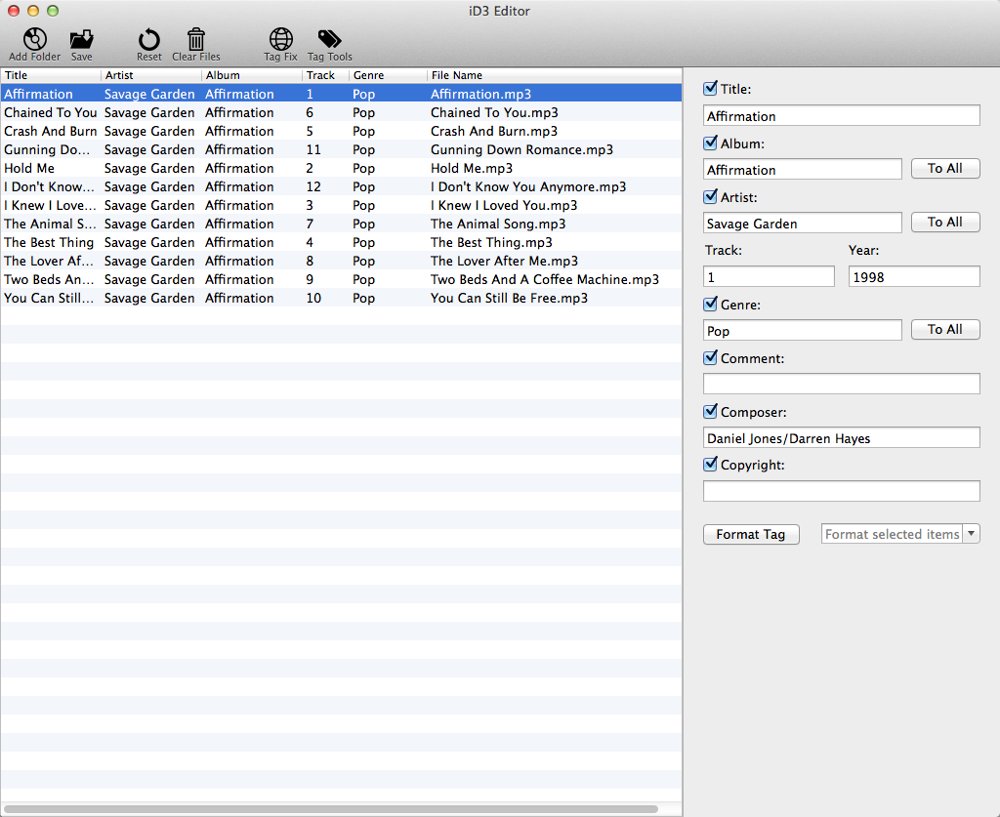

Welcome to iD3 Tag Editor
=========================

Thank you for choosing **iD3 Tag Editor**. This is a tool that helps you:

1. Batch editing music files;
1. Quickly fix tags that are incorrectly encoded;
1. Rename music files using tags;
1. Fetch tags from names of music files;

I really hope you will find it useful.

## Batch Editing Music Files ##
Below is the main window of **iD3 Tag Editor**. To edit a group of music files, simply highlight these files and enter new tag values in the text fields on the right side of the window.

Button "To All", allows you to apply an existing tag value (i.e. *album*, *artist*, or *genre*) to all music files. That may be useful under certain situations.

## Fix Language Encoding Of Tags ##
Sometimes, you may have music files in your collection that have incorrect character encodings. To fix the encoding:

1. Highlight these music files;
1. Click the toolbar button "Fix Tags";
1. Select a language encoding used by the tags of your music files;

If a correct language has been selected, your tags would be fixed automatically.

## Automatically Rename Music Files Using Tags ##
Suppose you have a group of music files, and they are not properly named. As an example, assume one music file named "2.mp3" has following tag values:

* **Album:** *Affirmation*
* **Artist:** *Savage Garden*
* **Track:** *1*
* **Title:** *Affirmation*

If you want to rename this file to *Affirmation-Savage Garden.mp3*, and you want other music files to be renamed similarly, simply:

1. Highlight these music files;
1. Click the toolbar button "Tag Tools";
1. Make sure tab "Tag To File Name" is selected;
1. In the text field, enter **:t-:a**;
1. In the label below, you will see an example of new file names;
1. Click "Apply" to rename music files;

The input text **:t-:a** tells **Tag Editor** that we want new filename starts with mp3 title (**:t**), followed by a dash (-), and ends with the artist (**:a**). In addition to **:t** and **:a**, You can refer to other tag values in new file names as well. Table below lists all symbols you can use to make references:

| Symbol | Tags values referred to |
|---|---|
|:a|artist|
|:A|album|
|:g|genre|
|:t|title|
|:T|track|
|:y|year|

Following are two more examples:

1. renaming files to ***track.title***: 
 * :T.:t
1. renaming files to ***track.title-album-artist-year***:
 * :T.:t-:A-:a-:y

**Limitation:** Renaming music files only works for music files saved under the Music folder  of your home directory. If you need to rename music files in other folders, please copy them into your Music folder first.

## Fetch Tags From Music File Names ##
Different from the story above, sometimes you might encounter music files missing certain tag values. If missing tag values can be found in file names, **iD3 Tag Editor** can be very useful to restore those tag values. Here is an example. Assume you have an mp3 file named *-example.com-Affirmation-Savage Garden-.mp3*. This file doesn't have tag values of song title and the artist. Luckily, these two values can be found in the file name -- *"Affirmation"* and *"Savage Garden"* respectively. To restore those tag values, 

1. Highlight these music files;
1. Click the toolbar button "Tag Tools";
1. Make sure tab "File Name To Tag" is selected;
1. In the text field, enter com-:t-:a-.mp3;
1. Titles and artists of highlighted music files are correctly fetched out of file names;
1. Click "Apply" to restore tag values;

The input text com-:t-:a-.mp3 means 

1. Title (**:t**) follows text *"com-"* in the file name; 
1. After the title, there is a single *"-"*;
1. *"-"* is followed by artist (**:a**);
1. Artist precedes text *"-.mp3"*;

In addition to **:t** and **:a**, there are sever other symbols you can use to fetch tag values from file names. The complete list is below (this table is same as the symbol table above):

| Symbol | Tags values to fetch |
|---|---|
|:a|artist|
|:A|album|
|:g|genre|
|:t|title|
|:T|track|
|:y|year|

**Hint:** When the missing tag value cannot be found in the file name, but in the folder name, uncheck the check box "File Name Only" will allow you to fetch the tag value from the folder name.

